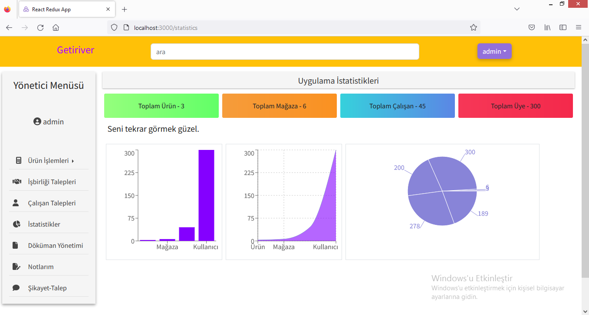

### e-commerce-app-laravel-react

### Proje laravel framework ve react kütüphanesi ile geliştirilmiştir. 
### Global state yönetimi için Redux Kullanılmıştır.
### 4 farklı user type e göre tasarlanmış proje de Admin , Mağaza Sahibi, Mağaza Çalışanı ve Müşteri olacak şekilde kurgulanmıştır.
### Müşteri sisteme kayıt yapıp girdiğinde mağaza açmak için talepte bulunur. Bu talepler admin tarafında karşılanır.
### Talebi onaylanan müşteri artık bir mağaza sahibidir ve admin tarafından sisteme eklelenen ürünlerden satmak istediğini stok ve fiyat girerek sistemine ekleyebilir.
### Mağaza sahibi çalışan eklemek için de talepte bulunur. Admin yine burda onay yetkisini kullanır. Kullanıcı daha önce sistemde var ise type'i değişir ve mail ile bilgilendirilir. Eğer sistemde olmayan bir email ise talep onayladığıında bir hesap açılır ve bu email'e giriş bilgileri için bir mail gönderilir. 
### Mağaza çalışanı yalnız ürünler üzerinde düzenleme yapabilir.
### Admin kategorilere ile ürünleri eklemek , gelen talepleri karşılamak ve genel sistemi yönetmek ile yükümlüdür. Admin dashboard da uygulamanın istatistikleri,
### Verilerin ekleneceği sayfalar ve taleplerin karşılandığı sayfalar mevcuttur. Kategoriler , tek tek elle veya excel ile yüklenebilir.
### Sistem geliştirilmeye devam edecektir.

